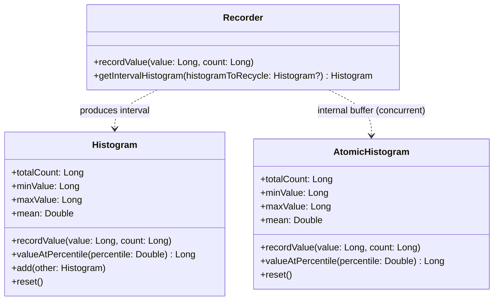

Español | [English](README.md) | [中文](README.zh-CN.md) 

# HdrHistogram-Kotlin

[](https://kotlinlang.org)
[](https://kotlinlang.org/docs/multiplatform.html)
[](http://www.apache.org/licenses/LICENSE-2.0)
[](https://central.sonatype.com/artifact/io.github.dsqrwym/hdrhistogram-kotlin)

> Nota: El borrador inicial de este README fue generado por IA (Antigravity) a partir de pruebas de rendimiento (benchmarks) en hardware real y análisis de la arquitectura del código fuente, y posteriormente revisado y ajustado por el autor del proyecto.

**HdrHistogram-Kotlin** es una biblioteca de histogramas de alto rango dinámico (High Dynamic Range, HDR) y alto rendimiento diseñada específicamente para [Kotlin Multiplatform (KMP)](https://kotlinlang.org/docs/multiplatform.html), comparada con y basada en la implementación nativa oficial en Java de Gil Tene [HdrHistogram](https://github.com/HdrHistogram/HdrHistogram).

Permite registrar y analizar eficazmente la distribución de valores de datos muestreados en un rango configurable de números enteros con **precisión relativa configurable** (dígitos significativos). Está diseñada para escenarios sensibles a la latencia como monitorización de rendimiento, APM, pruebas de red y métricas del sistema.

---

## Contenido

- [Características principales](#características-principales)
- [¿Por qué un histograma HDR?](#por-qué-un-histograma-hdr)
- [Plataformas compatibles](#plataformas-compatibles)
- [Arquitectura y API principal](#arquitectura-y-api-principal)
- [Guía de inicio rápido](#guía-de-inicio-rápido)
  - [1. Histograma monohilo básico (Histogram)](#1-histograma-monohilo-básico-histogram)
  - [2. Registro concurrente sin bloqueos (Recorder)](#2-registro-concurrente-sin-bloqueos-recorder)
  - [3. Histograma atómico multihilo (AtomicHistogram)](#3-histograma-atómico-multihilo-atomichistogram)
- [Pruebas de rendimiento (Informe de Benchmarks)](#pruebas-de-rendimiento-informe-de-benchmarks)
  - [Entorno de pruebas y metodología](#entorno-de-pruebas-y-metodología)
  - [1. Comparativa de rendimiento en JVM (Throughput - Mejor ejecución)](#1-comparativa-de-rendimiento-en-jvm-throughput---mejor-ejecución)
  - [2. Comparativa de latencia de escritura en JVM (Latency - Mejor ejecución)](#2-comparativa-de-latencia-de-escritura-en-jvm-latency---mejor-ejecución)
  - [3. Consumo de memoria y pruebas de cero asignación GC (Memory Footprint & Zero Allocation)](#3-consumo-de-memoria-y-pruebas-de-cero-asignación-gc-memory-footprint--zero-allocation)
  - [4. Tiempo de consulta de estadísticas y reinicio en JVM](#4-tiempo-de-consulta-de-estadísticas-y-reinicio-en-jvm)
  - [5. Rendimiento multiplataforma KMP (JVM vs WasmJS vs JS)](#5-rendimiento-multiplataforma-kmp-jvm-vs-wasmjs-vs-js)
- [Comandos para reproducir los benchmarks](#comandos-para-reproducir-los-benchmarks)
- [Análisis de rendimiento a bajo nivel y comparativa de diseño](#análisis-de-rendimiento-a-bajo-nivel-y-comparativa-de-diseño)
- [Agradecimientos y Licencia](#agradecimientos-y-licencia)

---

## Características principales

- **Complejidad constante en tiempo y espacio**: El espacio de memoria físico es constante, definido exclusivamente por el rango de valores y la precisión configurados en la construcción; **cero asignaciones en memoria (Zero GC / Allocation-free)** durante el registro de valores, sin sobrecarga de listas enlazadas, tablas hash o redimensionamiento dinámico de arrays.
- **Direccionamiento a nivel de bits sin bifurcaciones**: Calcula los índices de los buckets y sub-buckets directamente utilizando `countLeadingZeroBits` (instrucción CLZ del hardware del procesador) y máscaras de bits, eliminando bifurcaciones condicionales `if` en las rutas críticas de ejecución.
- **Concurrencia eficiente y doble búfer**:
  - El componente `Recorder` con doble búfer se basa en un sincronizador de rotación de dos fases (`WriterReaderPhaser`). Los hilos escritores registran valores con un único incremento atómico, mientras que los hilos lectores cambian de fase periódicamente para extraer instantáneas de intervalos sin bloquear a los escritores.
  - `AtomicHistogram` aprovecha instrucciones atómicas a nivel de bus de CPU (XADD / LDADD) para admitir escrituras multihilo altamente concurrentes.
- **Soporte nativo para Kotlin Multiplatform**: Una única base de código cubre JVM, Android, Linux (x64), macOS/iOS (Native), WebAssembly (WasmJS) y JavaScript.

---

## ¿Por qué un histograma HDR?

En la monitorización del rendimiento de sistemas (como SLAs, latencia de servicios o duración de transacciones), **las medias suelen ocultar las latencias de cola críticas** (por ejemplo, picos de latencia en los percentiles 99.9% o 99.99%).

Los histogramas tradicionales utilizan buckets lineales de ancho fijo (lo que provoca una explosión de memoria en rangos dinámicos amplios) o buckets logarítmicos de grano grueso (lo que deteriora drásticamente la resolución en valores altos).

**La solución de los histogramas HDR**:
Dividen los rangos de forma adaptativa basándose en un número configurado de **dígitos significativos (Significant Value Digits)**:
- Por ejemplo, configurando una precisión de `3` (garantizando una resolución relativa superior al 0.1%):
  - En el rango de $1\,\mu\text{s} \sim 2\,\text{ms}$, la resolución es de $1\,\mu\text{s}$;
  - En el rango de $2\,\text{ms} \sim 2\,\text{s}$, la resolución es de $1\,\text{ms}$;
  - En el rango de $2\,\text{s} \sim 2,000\,\text{s}$, la resolución es de $1\,\text{s}$.
- Independientemente de la magnitud del valor medido, **el error de medición se mantiene estrictamente por debajo del 0.1%**, mientras que el histograma completo ocupa solo entre unas decenas y unos cientos de kilobytes de memoria física.

---

## Plataformas compatibles

| Destino (Target) | Entorno / Arquitectura | Implementación de Concurrencia |
| :--- | :--- | :--- |
| **JVM** | Java 11+ / OpenJDK | Operaciones atómicas + `Thread.onSpinWait()` + Phaser de doble búfer |
| **Android** | Android 7.0+ (API 24+) | Operaciones atómicas + Phaser de doble búfer |
| **Native** | Linux (x64), iOS (Arm64/Simulator) | POSIX / Operaciones atómicas + ensamblador en línea `pause`/`yield` |
| **WasmJS** | WebAssembly (Node.js / Navegador) | Doble búfer eficiente monohilo |
| **JS** | JavaScript (Node.js / Navegador) | Doble búfer eficiente monohilo |

---

## Arquitectura y API principal



1. **[`Histogram`](#1-histograma-monohilo-básico-histogram)**: Histograma base no seguro para subprocesos con velocidad de registro en nanosegundos; ideal para uso monohilo, corrutinas confinadas o agregación de datos por lotes.
2. **[`AtomicHistogram`](#3-histograma-atómico-multihilo-atomichistogram)**: Histograma sin bloqueos diseñado para escritura concurrente multihilo, respaldado por arrays atómicos.
3. **[`Recorder`](#2-registro-concurrente-sin-bloqueos-recorder)**: Registrador de doble búfer optimizado para el rendimiento (throughput). Los hilos de trabajo escriben sin bloqueos mientras un hilo en segundo plano extrae periódicamente instantáneas de intervalo sin detener a los escritores.

---

## Guía de inicio rápido

### Agregar dependencia

Añade la dependencia a tu archivo `build.gradle.kts`:

```kotlin
repositories {
    mavenCentral()
}

kotlin {
    sourceSets {
        commonMain.dependencies {
            implementation("io.github.dsqrwym:hdrhistogram-kotlin:0.0.2")
        }
    }
}
```

### 1. Histograma monohilo básico (Histogram)

Adecuado para recolección monohilo, análisis de registros fuera de línea o como contenedor de agregación:

```kotlin
import io.github.dsqrwym.hdrhistogram.Histogram

// Crear un histograma: valor mínimo identificable 1ns, valor máximo rastreable 1 hora (3.6e12 ns), 3 dígitos significativos (0.1% de precisión)
val histogram = Histogram(
    lowestDiscernibleValue = 1L,
    highestTrackableValue = 3_600_000_000_000L,
    numberOfSignificantValueDigits = 3
)

// Registrar medidas de latencia (nanosegundos)
histogram.recordValue(1_500L)
histogram.recordValue(25_000L)
histogram.recordValue(100_000L, count = 10L) // Registrar en lote 10 veces

// Consultar métricas clave
println("Muestras totales: ${histogram.totalCount}")
println("Valor mínimo:     ${histogram.minValue} ns")
println("Valor máximo:     ${histogram.maxValue} ns")
println("Media:            ${histogram.mean} ns")
println("Mediana P50:      ${histogram.valueAtPercentile(50.0)} ns")
println("Percentil P99:    ${histogram.valueAtPercentile(99.0)} ns")
println("Percentil P99.9:  ${histogram.valueAtPercentile(99.9)} ns")

// Reiniciar el histograma (sin volver a asignar memoria)
histogram.reset()
```

### 2. Registro concurrente sin bloqueos (Recorder)

Recomendado para escenarios con registro continuo de alto rendimiento (p. ej. pasarelas API, servicios RPC, motores de trading) y generación periódica de métricas:

```kotlin
import io.github.dsqrwym.hdrhistogram.Recorder
import io.github.dsqrwym.hdrhistogram.Histogram
import kotlinx.coroutines.*
import kotlin.time.Duration.Companion.milliseconds

val recorder = Recorder(
    lowestDiscernibleValue = 1_000L,         // 1 microsegundo
    highestTrackableValue = 60_000_000_000L, // 60 segundos
    numberOfSignificantValueDigits = 3
)

// Simular múltiples hilos o corrutinas de escritura concurrentes
repeat(8) {
    CoroutineScope(Dispatchers.Default).launch {
        while (isActive) {
            val latencyNs = measureRequestTime()
            recorder.recordValue(latencyNs)
        }
    }
}

// Hilo independiente para recolección y reporte periódico de métricas (p. ej. cada 10 ms)
CoroutineScope(Dispatchers.Default).launch {
    // Pasar null la primera vez asignará una instancia de Histogram en memoria;
    // En las siguientes iteraciones, pasar la misma instancia la reutiliza tras limpiarla, con cero asignaciones para el recolector de basura (GC).
    var recycleHistogram: Histogram? = null
    while (isActive) {
        delay(10.milliseconds)
        
        // Alternar fase y obtener de forma fluida el histograma del intervalo, reutilizando la instancia anterior
        recycleHistogram = recorder.getIntervalHistogram(recycleHistogram)
        
        println("Peticiones en intervalo: ${recycleHistogram.totalCount}, " +
                "P99: ${recycleHistogram.valueAtPercentile(99.0)} ns, " +
                "P99.9: ${recycleHistogram.valueAtPercentile(99.9)} ns")
    }
}
```

### 3. Histograma atómico multihilo (AtomicHistogram)

Para casos donde múltiples hilos escriben concurrentemente en el mismo histograma:

```kotlin
import io.github.dsqrwym.hdrhistogram.AtomicHistogram

val atomicHistogram = AtomicHistogram(
    lowestDiscernibleValue = 1L,
    highestTrackableValue = 10_000_000L,
    numberOfSignificantValueDigits = 3
)

// Se puede invocar de forma concurrente desde cualquier hilo; utiliza instrucciones atómicas de CPU
atomicHistogram.recordValue(12345L)
```

> **Aviso importante**:
> La atomicidad de `AtomicHistogram` **solo garantiza la seguridad en la escritura multihilo** (sin pérdida de datos ni condiciones de carrera).
> Sin embargo, durante lecturas concurrentes (como invocar `valueAtPercentile`), **no proporciona una instantánea atómica globalmente consistente a través de todos los buckets** (los hilos escritores pueden actualizar buckets posteriores mientras la lectura recorre el array).
> **En entornos de producción que requieran lecturas consistentes periódicas junto a escrituras de alta frecuencia, utilice siempre `Recorder`**.

---

## Pruebas de rendimiento (Informe de Benchmarks)

Con el fin de ofrecer información técnica rigurosa y objetiva, comparamos **este proyecto** con la **biblioteca nativa oficial en Java (`org.hdrhistogram:HdrHistogram:2.2.2`)** bajo el mismo hardware y entorno de ejecución (incluyendo la lógica de comparación 1:1 de Gil Tene, modelos de carga representativos y mediciones de memoria).

### Entorno de pruebas y metodología

- **Procesador (CPU)**: AMD Ryzen 5 7530U with Radeon Graphics (6 núcleos / 12 subprocesos, base 2.0 GHz, turbo 4.5 GHz)
- **Memoria (RAM)**: 16 GB DDR4 (15.3 GB utilizables)
- **Sistema operativo**: Windows 11 64-bit
- **Entorno de ejecución Java**: OpenJDK 64-Bit Server VM (build 25.0.3+11-LTS)
- **Entorno de ejecución Node.js**: v24.15.0 (usado para pruebas JS y WasmJS)
- **Framework de benchmark**: [kotlinx-benchmark](https://github.com/Kotlin/kotlinx-benchmark) (basado en JMH 1.37)
- **Metodología**: Se ejecutaron **3 rondas independientes de benchmarks**, seleccionando la **ronda completa con mejor rendimiento global (Ronda 2)** para garantizar consistencia temporal y de carga en todas las métricas.

---

## 1. Comparativa de rendimiento en JVM (Throughput - Mejor ejecución)

> Unidad: `ops/sec` (operaciones completadas por segundo). **Mayor valor indica mejor rendimiento**.

| Escenario de prueba | Implementación oficial en Java (`HdrHistogram 2.2.2`) | Este proyecto en Kotlin (`HdrHistogram-Kotlin`) | Rendimiento relativo |
| :--- | :--- | :--- | :--- |
| **Escritura estándar 1:1 (`rawRecordingSpeed`)**<br>*(Equivalente al benchmark oficial: rango de 1h, precisión 3, valores dinámicos)* | **341,864,964** ops/s<br>(~342 millones ops/s) | **371,195,554** ops/s<br>(~371 millones ops/s) | **Aprox. 8.58% más rápido** |
| **Escritura en el mejor caso (`recordConstant`)**<br>*(Acierto continuo en caché L1 de CPU)* | **377,108,051** ops/s<br>(~377 millones ops/s) | **387,143,369** ops/s<br>(~387 millones ops/s) | **Aprox. 2.66% más rápido** |
| **Escritura dinámica real (`recordVarying`)**<br>*(Variación de microsegundos a milisegundos, evaluando indexación y predicción de saltos)* | **266,457,747** ops/s<br>(~266 millones ops/s) | **304,287,786** ops/s<br>(~304 millones ops/s) | **Aprox. 14.19% más rápido** |
| **Escritura por lotes con frecuencia (`recordVaryingWithCount`)**<br>*(Llamada única con incremento count = 10)* | **278,048,933** ops/s<br>(~278 millones ops/s) | **305,382,571** ops/s<br>(~305 millones ops/s) | **Aprox. 9.83% más rápido** |

---

## 2. Comparativa de latencia de escritura en JVM (Latency - Mejor ejecución)

> Unidad: `ns/op` (nanosegundos por operación). **Menor valor indica menor latencia (mejor)**.

| Caso de prueba | Implementación oficial en Java | Este proyecto en Kotlin | Comparativa |
| :--- | :--- | :--- | :--- |
| **Latencia estándar 1:1 (`rawRecordingLatency`)** | 2.869 ns | **2.700 ns** | Reducción de latencia de ~5.9% |
| **Latencia de valor constante (`recordConstantLatency`)** | 2.633 ns | **2.595 ns** | Prácticamente idéntico |
| **Latencia variable entre buckets (`recordVaryingLatency`)** | 3.746 ns | **3.280 ns** | Reducción de latencia de ~12.4% |
| **Latencia con frecuencia por lote (`recordValueLatency`)** | 3.604 ns | **3.263 ns** | Reducción de latencia de ~9.5% |

---

## 3. Consumo de memoria y pruebas de cero asignación GC (Memory Footprint & Zero Allocation)

Uno de los aspectos más destacados de los histogramas HDR es su huella de memoria física **estrictamente constante y reducida**, además de **cero asignaciones en el montón (Zero Allocation)** durante el registro de datos.

### 1) Comparativa estática de huella de memoria

Dado que más del 99.9% de la memoria de un histograma corresponde al array subyacente `LongArray`, el consumo viene determinado en su totalidad por los parámetros del constructor (la cabecera del objeto y sus campos solo ocupan unos 100 bytes):

| Configuración típica | Rango cubierto | Implementación oficial en Java | Este proyecto en Kotlin | Cantidad de elementos (`counts`) |
| :--- | :--- | :--- | :--- | :--- |
| **Rango de 10 millones de $\mu\text{s}$ (Precisión 3)** | $1\,\mu\text{s} \sim 10\,\text{s}$ | **115.2 KB** (115,200 bytes) | **114.7 KB** (114,752 bytes) | 14,336 Longs |
| **Rango de 1 hora en $\mu\text{s}$ (Precisión 3)** | $1\,\mu\text{s} \sim 1\,\text{hora}$ | **188.9 KB** (188,928 bytes) | **188.4 KB** (188,480 bytes) | 23,552 Longs |
| **Rango de 1 día en $\mu\text{s}$ (Precisión 3)** | $1\,\mu\text{s} \sim 24\,\text{horas}$ | **221.7 KB** (221,696 bytes) | **221.2 KB** (221,248 bytes) | 27,648 Longs |

- **Ocupación fija**: Tanto si se registra un único valor como si se procesan mil millones de muestras, la memoria permanece fija sin ampliaciones dinámicas de arrays.
- **Cálculo directo**: La memoria real del array subyacente se calcula mediante `countsArrayLength * 8 bytes`.

### 2) Asignaciones dinámicas en ejecución (Medición con ThreadMXBean)

Para verificar empíricamente la ausencia de asignaciones, empleamos `com.sun.management.ThreadMXBean.getThreadAllocatedBytes()` de la JVM para monitorizar los **bytes reales asignados por el sistema operativo y la JVM en el hilo de trabajo** tras la carga de clases y el calentamiento de JIT:

| Operación analizada | Invocaciones | Bytes totales asignados en heap | Asignación media por op (B/op) | Conclusión |
| :--- | :--- | :--- | :--- | :--- |
| **`Histogram.recordValue`** | 1,000,000 | **0 bytes** | **0.000 B/op** | Modificación directa en array primitivo, cero GC |
| **`Recorder.recordValue`** | 1,000,000 | **0 bytes** | **0.000 B/op** | Incremento atómico, cero GC |
| **`Recorder.getIntervalHistogram` (Reutilización)** | 50,000 | **0 bytes** | **0.000 B/op** | Rotación con reutilización de instancia previa, cero GC |
| **`Histogram.reset`** | 100,000 | **0 bytes** | **0.000 B/op** | Puesta a cero del array, cero asignaciones |

---

## 4. Tiempo de consulta de estadísticas y reinicio en JVM

> Calculado sobre un histograma precargado con 100,000 muestras realistas desde microsegundos hasta milisegundos de cola (datos de la mejor ejecución).

| Método de consulta | Implementación oficial en Java | Este proyecto en Kotlin | Detalle |
| :--- | :--- | :--- | :--- |
| **Total de muestras `totalCount`** | 0.541 ns | **0.540 ns** | Retorno directo a nivel de registro de CPU |
| **Valor mínimo `minValue`** | 1.690 ns | **1.485 ns** | Incluye alineación de valor equivalente |
| **Valor máximo `maxValue`** | 1.261 ns | **1.116 ns** | Incluye alineación de valor equivalente |
| **Mediana `getP50`** | 720.46 ns | **628.99 ns** | Recorrido hasta el sub-bucket del rango |
| **Percentil P90 `getP90`** | 850.10 ns | **849.45 ns** | Recorrido hasta el sub-bucket del rango |
| **Percentil P99 `getP99`** | 1710.36 ns | **1712.73 ns** | Recorrido hasta el sub-bucket de cola |
| **Percentil P99.9 `getP999`** | 3401.90 ns | **3411.36 ns** | Recorrido hasta el sub-bucket de cola extrema |
| **Cálculo de media completa `getMean`** | 86.086 $\mu\text{s}$ | **14.354 $\mu\text{s}$** | ~6.0 veces más rápido (iteración plana sobre array) |
| **Reinicio de histograma `reset`** | 1.137 $\mu\text{s}$ | **1.115 $\mu\text{s}$** | Puesta a cero rápida del array |

---

## 5. Rendimiento multiplataforma KMP (JVM vs WasmJS vs JS)

Gracias a las operaciones a nivel de bits y al diseño sin asignaciones, la biblioteca presenta un rendimiento sobresaliente en WebAssembly (Wasm):

| Prueba de benchmark | JVM (OpenJDK 25) | WasmJS (Motor V8) | JS (Node.js V8) |
| :--- | :--- | :--- | :--- |
| **Throughput estándar (`rawRecordingSpeed`)** | **371.20 M** ops/s | **122.68 M** ops/s *(~33% de JVM)* | 4.97 M ops/s |
| **Throughput con valor constante (`recordConstant`)** | **388.68 M** ops/s | **297.43 M** ops/s *(~76% de JVM)* | 3.64 M ops/s |
| **Throughput dinámico variable (`recordVarying`)** | **304.29 M** ops/s | **109.06 M** ops/s | 3.24 M ops/s |
| **Latencia estándar (`rawRecordingLatency`)** | **2.70 ns** | **8.21 ns** | 251.33 ns |
| **Consulta percentil P50** | **0.63 $\mu\text{s}$** | **2.23 $\mu\text{s}$** | 104.50 $\mu\text{s}$ |
| **Consulta percentil P99** | **1.71 $\mu\text{s}$** | **6.47 $\mu\text{s}$** | 312.13 $\mu\text{s}$ |

> **Recomendación multiplataforma**:
> Para la recolección de métricas de alta frecuencia en navegadores o entornos Node.js, **se recomienda enfáticamente utilizar WasmJS**: ofrece un rendimiento entre **25 y 80 veces mayor** que JS estándar, con latencias de escritura de tan solo **7 a 9 nanosegundos**.

---

## Comandos para reproducir los benchmarks

Puedes reproducir todas las pruebas localmente ejecutando las tareas correspondientes de Gradle:

### 1. Ejecutar comparativa en JVM frente a la biblioteca oficial de Java

```bash
# Ejecutar los benchmarks de JVM (incluye la biblioteca de Java y este proyecto)
./gradlew :library:jvmBenchmarkBenchmark
```

### 2. Ejecutar pruebas de memoria física y cero asignaciones GC

```bash
# Ejecutar pruebas de memoria heap basadas en ThreadMXBean
./gradlew :library:jvmTest --tests "test.JvmMemoryAllocationTest"
```

### 3. Ejecutar benchmarks en WebAssembly (WasmJS)

```bash
# Requiere Node.js instalado en el sistema
./gradlew :library:wasmJsBenchmarkBenchmark
```

### 4. Ejecutar benchmarks en JavaScript (Node.js)

```bash
./gradlew :library:jsBenchmarkBenchmark
```

### 5. Ejecutar todas las pruebas unitarias y de concurrencia

```bash
# Ejecutar pruebas en todas las plataformas (incluye pruebas de coherencia multihilo)
./gradlew allTests
```

---

## Análisis de rendimiento a bajo nivel y comparativa de diseño

El **algoritmo de mapeo de rangos sin saltos condicionales basado en el recuento de ceros iniciales** ideado por Gil Tene (`leadingZeroCountBase - Long.numberOfLeadingZeros(value | subBucketMask)`) es la base matemática que permite registrar valores en nanosegundos.

Manteniendo esta base matemática, este proyecto incorpora optimizaciones clave:

1. **Eliminación del desplazamiento de normalización (`normalizingIndexOffset`)**:
   La biblioteca oficial de Java calcula dinámicamente `normalizeIndex(index, offset, length)` en cada escritura para admitir redimensionamiento automático y conversión a coma flotante. Este proyecto se enfoca en rangos y precisiones enteras fijas de alto rendimiento, asignando índices directamente sobre el array físico y eliminando una suma, una operación módulo y bifurcaciones de control de límites.
2. **Inlining de funciones críticas (`inline`)**:
   Operaciones esenciales como `countsArrayIndex`, `bucketIndex` y `lowestEquivalentValue` están marcadas como `inline`. Al expandirse durante la compilación en Kotlin, eliminan la sobrecarga de marcos de llamada en la pila y el despacho virtual de métodos.
3. **Cálculo de la media (`mean`) mediante iteración directa en el array**:
   La biblioteca oficial en Java crea una instancia de `RecordedValuesIterator` en `getMean()` para recorrer el histograma. Este proyecto itera directamente sobre el array físico `LongArray`, calculando el valor medio de los buckets no nulos sin instanciaciones en memoria ni gestión de estado de iteradores.

---

## Agradecimientos y Licencia

- Publicado bajo la licencia [Apache License 2.0](http://www.apache.org/licenses/LICENSE-2.0).
- Los algoritmos principales, estructuras de datos y modelos matemáticos provienen del destacado trabajo de [Gil Tene](https://github.com/giltene): [HdrHistogram](https://github.com/HdrHistogram/HdrHistogram). Agradecemos profundamente al autor original y a su comunidad por poner a disposición del ecosistema una infraestructura de métricas tan sobresaliente.
