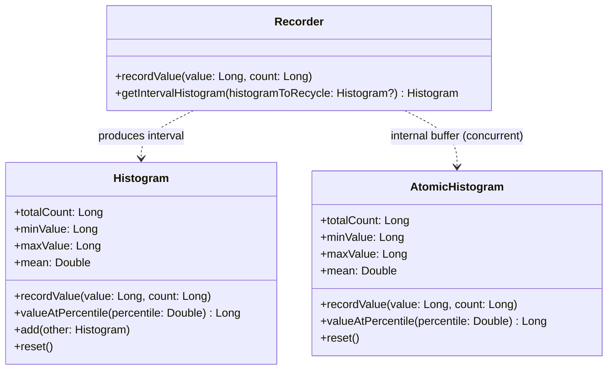

English | [中文](README.zh-CN.md) | [Español](README.es.md)

# HdrHistogram-Kotlin

[](https://kotlinlang.org)
[](https://kotlinlang.org/docs/multiplatform.html)
[](http://www.apache.org/licenses/LICENSE-2.0)
[](https://central.sonatype.com/artifact/io.github.dsqrwym/hdrhistogram-kotlin)

> Note: The initial draft of this README was generated by AI (Antigravity) based on real-machine benchmark tests and source code architecture analysis, and subsequently reviewed and fine-tuned by the project author.

**HdrHistogram-Kotlin** is a high-performance, High Dynamic Range (HDR) histogram library specifically built for [Kotlin Multiplatform (KMP)](https://kotlinlang.org/docs/multiplatform.html), benchmarked against and inspired by Gil Tene's official Java native implementation [HdrHistogram](https://github.com/HdrHistogram/HdrHistogram).

It supports recording and analyzing sampled data value distributions across a configurable integer range with **configurable relative precision** (number of significant digits). It is designed specifically for latency-sensitive performance monitoring, APM, network testing, system metrics, and related use cases.

---

## Table of Contents

- [Core Features](#core-features)
- [Why HDR Histogram?](#why-hdr-histogram)
- [Supported Platforms](#supported-platforms)
- [Core API & Architecture](#core-api--architecture)
- [Quick Start](#quick-start)
  - [1. Basic Single-Threaded Histogram (Histogram)](#1-basic-single-threaded-histogram-histogram)
  - [2. Concurrent Lock-Free Recording (Recorder)](#2-concurrent-lock-free-recording-recorder)
  - [3. Multi-Threaded Atomic Histogram (AtomicHistogram)](#3-multi-threaded-atomic-histogram-atomichistogram)
- [Performance Benchmarks (Benchmark Report)](#performance-benchmarks-benchmark-report)
  - [Test Machine Environment & Methodology](#test-machine-environment--methodology)
  - [1. JVM Throughput Comparison (Throughput - Best Single Run)](#1-jvm-throughput-comparison-throughput---best-single-run)
  - [2. JVM Write Latency Comparison (Latency - Best Single Run)](#2-jvm-write-latency-comparison-latency---best-single-run)
  - [3. Memory Footprint & Zero-Allocation Testing](#3-memory-footprint--zero-allocation-testing)
  - [4. JVM Statistics Query and Reset Latency](#4-jvm-statistics-query-and-reset-latency)
  - [5. KMP Cross-Platform Performance (JVM vs WasmJS vs JS)](#5-kmp-cross-platform-performance-jvm-vs-wasmjs-vs-js)
- [Commands to Reproduce Benchmarks](#commands-to-reproduce-benchmarks)
- [Low-Level Performance Analysis & Design Comparison](#low-level-performance-analysis--design-comparison)
- [Acknowledgments & License](#acknowledgments--license)

---

## Core Features

- **Constant Space and Time Complexity**: Physical memory footprint is constant, determined entirely by the configured value range and precision at construction; **zero memory allocations (Zero GC / Allocation-free)** during value recording, with no linked lists, hash tables, or dynamic array resizing overhead.
- **Branchless Bitwise Addressing**: Computes bucket and sub-bucket indices directly using `countLeadingZeroBits` (hardware CPU CLZ instruction) and bitmasks, eliminating `if` branches from critical hot paths.
- **Efficient Concurrency & Double Buffering**:
  - The double-buffering `Recorder` is built on a two-phase rotating synchronizer (`WriterReaderPhaser`). Writer threads record data with just a single atomic increment, while reader threads periodically flip phases to extract interval snapshots without locking active writers.
  - `AtomicHistogram` leverages CPU hardware-level atomic bus instructions (XADD / LDADD) to support high-concurrency multi-threaded writes directly.
- **Native Kotlin Multiplatform Support**: A unified codebase fully covers JVM, Android, Linux (x64), macOS/iOS (Native), WebAssembly (WasmJS), and JavaScript.

---

## Why HDR Histogram?

In system performance monitoring (such as SLAs, service latencies, and transaction durations), **averages often conceal critical tail latencies** (such as the 99.9th or 99.99th percentile request spikes).

Traditional histograms either use fixed-width linear buckets (causing memory explosion over large dynamic ranges) or coarse logarithmic buckets (causing severe loss of resolution at higher values).

**The HDR Histogram Solution**:
HDR Histograms partition ranges adaptively based on a configured number of **Significant Value Digits**:
- For example, configured with a precision of `3` (guaranteeing relative resolution better than 0.1%):
  - In the $1\,\mu\text{s} \sim 2\,\text{ms}$ range, resolution is accurate to $1\,\mu\text{s}$;
  - In the $2\,\text{ms} \sim 2\,\text{s}$ range, resolution is accurate to $1\,\text{ms}$;
  - In the $2\,\text{s} \sim 2,000\,\text{s}$ range, resolution is accurate to $1\,\text{s}$.
- Regardless of the magnitude of the measured value, **measurement error is strictly bounded within 0.1%**, while the entire histogram occupies only tens to hundreds of kilobytes of memory.

---

## Supported Platforms

| Platform Target | Runtime / Architecture | Concurrency Model Implementation |
| :--- | :--- | :--- |
| **JVM** | Java 11+ / OpenJDK | Atomic operations + `Thread.onSpinWait()` + Double-buffered Phaser |
| **Android** | Android 7.0+ (API 24+) | Atomic operations + Double-buffered Phaser |
| **Native** | Linux (x64), iOS (Arm64/Simulator) | POSIX / Atomic operations + `pause`/`yield` inline assembly |
| **WasmJS** | WebAssembly (Node.js / Browser) | Single-threaded efficient double buffering |
| **JS** | JavaScript (Node.js / Browser) | Single-threaded efficient double buffering |

---

## Core API & Architecture



1. **[`Histogram`](#1-basic-single-threaded-histogram-histogram)**: Non-thread-safe base histogram with nanosecond-level recording speed, suitable for single-threaded, coroutine-confined, or batch aggregation scenarios.
2. **[`AtomicHistogram`](#3-multi-threaded-atomic-histogram-atomichistogram)**: Lock-free histogram supporting high-concurrency multi-threaded writes, backed by atomic arrays.
3. **[`Recorder`](#2-concurrent-lock-free-recording-recorder)**: Double-buffered recorder prioritized for throughput. Worker threads record lock-free, while a background reporting thread periodically extracts interval snapshots without stalling writers.

---

## Quick Start

### Adding Dependencies

Add the dependency to your `build.gradle.kts`:

```kotlin
repositories {
    mavenCentral()
}

kotlin {
    sourceSets {
        commonMain.dependencies {
            implementation("io.github.dsqrwym:hdrhistogram-kotlin:0.0.2")
        }
    }
}
```

### 1. Basic Single-Threaded Histogram (Histogram)

Suitable for single-threaded recording, offline log analysis, or as an aggregation container:

```kotlin
import io.github.dsqrwym.hdrhistogram.Histogram

// Create a histogram: lowest discernible value 1ns, highest trackable value 1 hour (3.6e12 ns), 3 significant digits (0.1% precision)
val histogram = Histogram(
    lowestDiscernibleValue = 1L,
    highestTrackableValue = 3_600_000_000_000L,
    numberOfSignificantValueDigits = 3
)

// Record latency measurements (nanoseconds)
histogram.recordValue(1_500L)
histogram.recordValue(25_000L)
histogram.recordValue(100_000L, count = 10L) // Batch record 10 occurrences

// Query key metrics
println("Total count:  ${histogram.totalCount}")
println("Min value:    ${histogram.minValue} ns")
println("Max value:    ${histogram.maxValue} ns")
println("Mean:         ${histogram.mean} ns")
println("P50 Median:   ${histogram.valueAtPercentile(50.0)} ns")
println("P99:          ${histogram.valueAtPercentile(99.0)} ns")
println("P99.9:        ${histogram.valueAtPercentile(99.9)} ns")

// Reset the histogram (without reallocating memory)
histogram.reset()
```

### 2. Concurrent Lock-Free Recording (Recorder)

Recommended for continuous high-throughput recording (e.g., API gateways, RPC services, trading engines) where metrics are reported periodically in the background:

```kotlin
import io.github.dsqrwym.hdrhistogram.Recorder
import io.github.dsqrwym.hdrhistogram.Histogram
import kotlinx.coroutines.*
import kotlin.time.Duration.Companion.milliseconds

val recorder = Recorder(
    lowestDiscernibleValue = 1_000L,         // 1 microsecond
    highestTrackableValue = 60_000_000_000L, // 60 seconds
    numberOfSignificantValueDigits = 3
)

// Simulate multiple concurrent writer threads / coroutines
repeat(8) {
    CoroutineScope(Dispatchers.Default).launch {
        while (isActive) {
            val latencyNs = measureRequestTime()
            recorder.recordValue(latencyNs)
        }
    }
}

// Independent metric collection and logging thread (e.g. collecting every 10 ms)
CoroutineScope(Dispatchers.Default).launch {
    // Passing null initially allocates a Histogram instance on the heap;
    // Passing the same instance back to getIntervalHistogram on subsequent cycles resets and reuses it with zero GC allocation.
    var recycleHistogram: Histogram? = null
    while (isActive) {
        delay(10.milliseconds)
        
        // Flip phase and seamlessly obtain interval histogram, reusing the old instance
        recycleHistogram = recorder.getIntervalHistogram(recycleHistogram)
        
        println("Interval count: ${recycleHistogram.totalCount}, " +
                "P99: ${recycleHistogram.valueAtPercentile(99.0)} ns, " +
                "P99.9: ${recycleHistogram.valueAtPercentile(99.9)} ns")
    }
}
```

### 3. Multi-Threaded Atomic Histogram (AtomicHistogram)

Used when multiple threads concurrently record directly into a single shared histogram:

```kotlin
import io.github.dsqrwym.hdrhistogram.AtomicHistogram

val atomicHistogram = AtomicHistogram(
    lowestDiscernibleValue = 1L,
    highestTrackableValue = 10_000_000L,
    numberOfSignificantValueDigits = 3
)

// Can be called concurrently from any thread; utilizes atomic instructions under the hood
atomicHistogram.recordValue(12345L)
```

> **Important Note**:
> The atomicity of `AtomicHistogram` **only guarantees thread safety for write operations** (no lost counts or data races).
> However, concurrent reads (such as calling `valueAtPercentile`) **do not provide a globally consistent atomic snapshot across all buckets** (i.e. writing threads may update subsequent buckets while a reader traverses the array).
> **For production scenarios requiring high-frequency multi-threaded writes alongside periodic consistent metric reads, always use `Recorder`**.

---

## Performance Benchmarks (Benchmark Report)

To provide rigorous and objective data, we compared **this project** against the **official native Java library (`org.hdrhistogram:HdrHistogram:2.2.2`)** under identical hardware and runtime conditions (including Gil Tene's 1:1 benchmark logic, typical workload models, and memory overhead).

### Test Machine Environment & Methodology

- **Processor (CPU)**: AMD Ryzen 5 7530U with Radeon Graphics (6 cores / 12 threads, base 2.0 GHz, boost 4.5 GHz)
- **Memory (RAM)**: 16 GB DDR4 (15.3 GB usable)
- **Operating System**: Windows 11 64-bit
- **Java Runtime**: OpenJDK 64-Bit Server VM (build 25.0.3+11-LTS)
- **Node.js Runtime**: v24.15.0 (used for JS and WasmJS tests)
- **Benchmark Framework**: [kotlinx-benchmark](https://github.com/Kotlin/kotlinx-benchmark) (based on JMH 1.37)
- **Methodology**: Executed **3 independent benchmark runs**, selecting the **overall best-performing full run (Run 2)** to ensure temporal and system load consistency across all reported metrics.

---

## 1. JVM Throughput Comparison (Throughput - Best Single Run)

> Unit: `ops/sec` (operations completed per second). **Higher is better**.

| Benchmark Scenario | Official Java (`HdrHistogram 2.2.2`) | This Project (`HdrHistogram-Kotlin`) | Relative Performance |
| :--- | :--- | :--- | :--- |
| **Official 1:1 Benchmark Write (`rawRecordingSpeed`)**<br>*(Matches official benchmark: 1h range, 3 digits, varying values)* | **341,864,964** ops/s<br>(~342M ops/s) | **371,195,554** ops/s<br>(~371M ops/s) | **~8.58% faster** |
| **Best-Case Write (`recordConstant`)**<br>*(Extreme L1 CPU cache hit)* | **377,108,051** ops/s<br>(~377M ops/s) | **387,143,369** ops/s<br>(~387M ops/s) | **~2.66% faster** |
| **Realistic Dynamic Write (`recordVarying`)**<br>*(Spanning $\mu\text{s}$ to ms tail, testing bucket indexing & branch prediction)* | **266,457,747** ops/s<br>(~266M ops/s) | **304,287,786** ops/s<br>(~304M ops/s) | **~14.19% faster** |
| **Batch Write with Count (`recordVaryingWithCount`)**<br>*(Single call adding count = 10)* | **278,048,933** ops/s<br>(~278M ops/s) | **305,382,571** ops/s<br>(~305M ops/s) | **~9.83% faster** |

---

## 2. JVM Write Latency Comparison (Latency - Best Single Run)

> Unit: `ns/op` (nanoseconds per operation). **Lower is better**.

| Benchmark Scenario | Official Java | This Project (`HdrHistogram-Kotlin`) | Difference |
| :--- | :--- | :--- | :--- |
| **Official 1:1 Latency (`rawRecordingLatency`)** | 2.869 ns | **2.700 ns** | ~5.9% lower latency |
| **Single-Value Constant Latency (`recordConstantLatency`)** | 2.633 ns | **2.595 ns** | On par |
| **Varying Cross-Bucket Latency (`recordVaryingLatency`)** | 3.746 ns | **3.280 ns** | ~12.4% lower latency |
| **Batch Value Latency (`recordValueLatency`)** | 3.604 ns | **3.263 ns** | ~9.5% lower latency |

---

## 3. Memory Footprint & Zero-Allocation Testing

One of the defining designs of HDR Histogram is its **strictly constant and minimal** physical memory footprint, along with **zero heap allocations (Zero Allocation)** while recording data.

### 1) Static Memory Footprint Comparison

Because over 99.9% of histogram memory is occupied by the underlying `LongArray` count storage, memory consumption is determined entirely by constructor parameters (object headers and fields take only ~100 bytes):

| Typical Configuration | Covered Range | Official Java Implementation | This Project (`HdrHistogram-Kotlin`) | Array Element Count (`counts`) |
| :--- | :--- | :--- | :--- | :--- |
| **10 Million $\mu\text{s}$ Range (3 Digits)** | $1\,\mu\text{s} \sim 10\,\text{s}$ | **115.2 KB** (115,200 bytes) | **114.7 KB** (114,752 bytes) | 14,336 Longs |
| **1 Hour $\mu\text{s}$ Range (3 Digits)** | $1\,\mu\text{s} \sim 1\,\text{hour}$ | **188.9 KB** (188,928 bytes) | **188.4 KB** (188,480 bytes) | 23,552 Longs |
| **1 Day $\mu\text{s}$ Range (3 Digits)** | $1\,\mu\text{s} \sim 24\,\text{hours}$ | **221.7 KB** (221,696 bytes) | **221.2 KB** (221,248 bytes) | 27,648 Longs |

- **Constant Footprint**: Whether recording 1 value or 1 billion samples, the physical footprint remains strictly constant, with zero dynamic array resizing.
- **Direct Calculation**: The underlying array size can be derived directly via `countsArrayLength * 8 bytes`.

### 2) Dynamic Runtime Allocations (Measured via ThreadMXBean)

To verify zero-allocation claims empirically, we used JVM's `com.sun.management.ThreadMXBean.getThreadAllocatedBytes()` to inspect the **actual heap bytes allocated by the operating system and JVM to the thread** before and after massive operations, after class loading and JIT warmup:

| Core Operation Tested | Invocations | Total Heap Bytes Allocated | Average Allocation (B/op) | Conclusion |
| :--- | :--- | :--- | :--- | :--- |
| **`Histogram.recordValue`** | 1,000,000 | **0 bytes** | **0.000 B/op** | Primitive array mutation, zero GC |
| **`Recorder.recordValue`** | 1,000,000 | **0 bytes** | **0.000 B/op** | Atomic increment, zero GC |
| **`Recorder.getIntervalHistogram` (Recycled)** | 50,000 | **0 bytes** | **0.000 B/op** | Double-buffer rotation reusing instance, zero GC |
| **`Histogram.reset`** | 100,000 | **0 bytes** | **0.000 B/op** | Fast array zeroing, zero heap allocation |

---

## 4. JVM Statistics Query and Reset Latency

> Evaluated on a pre-populated histogram containing 100,000 realistic samples spanning $\mu\text{s}$ to tail ms (data from the best full run).

| Query Method | Official Java | This Project (`HdrHistogram-Kotlin`) | Description |
| :--- | :--- | :--- | :--- |
| **Get Total Count `totalCount`** | 0.541 ns | **0.540 ns** | Register-level constant read |
| **Get Min Value `minValue`** | 1.690 ns | **1.485 ns** | Includes equivalent value alignment calculation |
| **Get Max Value `maxValue`** | 1.261 ns | **1.116 ns** | Includes equivalent value alignment calculation |
| **Median `getP50`** | 720.46 ns | **628.99 ns** | Traversing to bucket matching rank |
| **P90 Percentile `getP90`** | 850.10 ns | **849.45 ns** | Traversing to bucket matching rank |
| **P99 Percentile `getP99`** | 1710.36 ns | **1712.73 ns** | Traversing to tail sub-bucket |
| **P99.9 Percentile `getP999`** | 3401.90 ns | **3411.36 ns** | Traversing to extreme tail sub-bucket |
| **Full Mean Calculation `getMean`** | 86.086 $\mu\text{s}$ | **14.354 $\mu\text{s}$** | ~6.0x faster (direct flat array iteration) |
| **Full Histogram Reset `reset`** | 1.137 $\mu\text{s}$ | **1.115 $\mu\text{s}$** | Fast array zeroing |

---

## 5. KMP Cross-Platform Performance (JVM vs WasmJS vs JS)

Benefiting from pure bitwise logic and zero-allocation design, this library demonstrates exceptional performance on WebAssembly (Wasm):

| Benchmark Item | JVM (OpenJDK 25) | WasmJS (V8 Engine) | JS (Node.js V8) |
| :--- | :--- | :--- | :--- |
| **Official Benchmark Throughput (`rawRecordingSpeed`)** | **371.20 M** ops/s | **122.68 M** ops/s *(~33% of JVM)* | 4.97 M ops/s |
| **Constant Write Throughput (`recordConstant`)** | **388.68 M** ops/s | **297.43 M** ops/s *(~76% of JVM)* | 3.64 M ops/s |
| **Varying Value Throughput (`recordVarying`)** | **304.29 M** ops/s | **109.06 M** ops/s | 3.24 M ops/s |
| **Official Latency Benchmark (`rawRecordingLatency`)** | **2.70 ns** | **8.21 ns** | 251.33 ns |
| **P50 Percentile Query** | **0.63 $\mu\text{s}$** | **2.23 $\mu\text{s}$** | 104.50 $\mu\text{s}$ |
| **P99 Percentile Query** | **1.71 $\mu\text{s}$** | **6.47 $\mu\text{s}$** | 312.13 $\mu\text{s}$ |

> **Cross-Platform Recommendation**:
> When collecting high-frequency performance metrics in browser or Node.js environments, **WasmJS is strongly recommended**—it delivers **25x ~ 80x** higher throughput than plain JS, with write latency as low as **7 ~ 9 nanoseconds**.

---

## Commands to Reproduce Benchmarks

You can reproduce all benchmark data locally using the project's Gradle tasks:

### 1. Run JVM Benchmarks Comparing Against Official Java Library

```bash
# Run full JVM benchmarks (including both official Java library and this project)
./gradlew :library:jvmBenchmarkBenchmark
```

### 2. Run Physical Memory and Zero-Allocation Tests

```bash
# Run JVM ThreadMXBean-based heap allocation and footprint tests
./gradlew :library:jvmTest --tests "test.JvmMemoryAllocationTest"
```

### 3. Run WebAssembly (WasmJS) Benchmarks

```bash
# Requires Node.js installed locally
./gradlew :library:wasmJsBenchmarkBenchmark
```

### 4. Run JavaScript (Node.js) Benchmarks

```bash
./gradlew :library:jsBenchmarkBenchmark
```

### 5. Run All Platform Unit Tests & Concurrency Verification

```bash
# Run all unit tests across platforms (including multi-threaded consistency tests)
./gradlew allTests
```

---

## Low-Level Performance Analysis & Design Comparison

Gil Tene's **branchless bucket mapping algorithm based on leading zeros** (`leadingZeroCountBase - Long.numberOfLeadingZeros(value | subBucketMask)`) forms the mathematical cornerstone enabling HDR Histograms to record in nanoseconds.

While inheriting this mathematical model, this project introduces focused engineering simplifications:

1. **Elimination of Normalizing Index Offset (`normalizingIndexOffset`)**:
   The official Java library dynamically calls `normalizeIndex(index, offset, length)` during every write to support auto-resizing and floating-point conversions. This project focuses on fixed-range and fixed-precision high-performance integer scenarios, mapping indices directly to the physical array and eliminating an extra addition, modulo, and potential bounds checking branches.
2. **End-to-End Inlining (`inline`)**:
   Core operators such as `countsArrayIndex`, `bucketIndex`, and `lowestEquivalentValue` are marked as `inline`. In combination with Kotlin's compiler inlining, this eliminates call stack frame overhead and virtual method dispatch.
3. **Direct Array Traversal for Mean Calculation (`mean`)**:
   Official Java's `getMean()` instantiates a `RecordedValuesIterator` to traverse the histogram. This project iterates directly across the physical `LongArray`, calculating equivalent midpoint values on non-zero buckets without heap allocations or iterator state overhead.

---

## Acknowledgments & License

- Licensed under the [Apache License 2.0](http://www.apache.org/licenses/LICENSE-2.0).
- Core algorithms, data structures, and mathematical models originate from the outstanding work of [Gil Tene](https://github.com/giltene): [HdrHistogram](https://github.com/HdrHistogram/HdrHistogram). Many thanks to the original author and the community for providing such an exceptional performance metric infrastructure to the open-source ecosystem.
