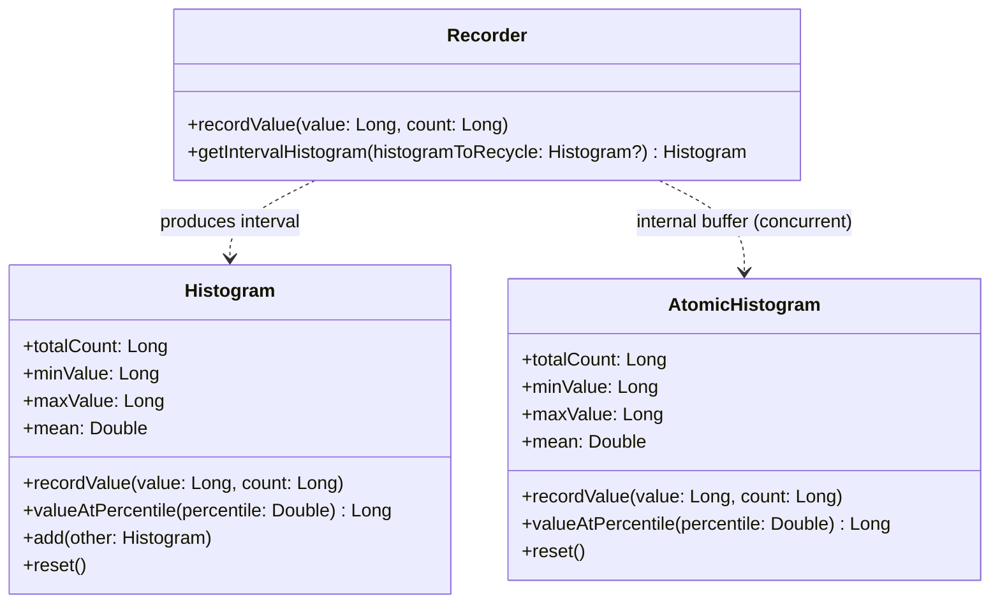

中文 | [English](README.md) | [Español](README.es.md)

# HdrHistogram-Kotlin

[](https://kotlinlang.org)
[](https://kotlinlang.org/docs/multiplatform.html)
[](http://www.apache.org/licenses/LICENSE-2.0)
[](https://central.sonatype.com/artifact/io.github.dsqrwym/hdrhistogram-kotlin)

> 注：本 README 初稿由 AI (Antigravity) 基于实机基准测试与源码架构分析生成，后经项目作者审查与微调。

**HdrHistogram-Kotlin** 是专门为 [Kotlin Multiplatform (KMP)](https://kotlinlang.org/docs/multiplatform.html) 打造的高性能、高动态范围（High Dynamic Range, HDR）直方图库，对标并参考了 Gil Tene 的官方 Java 原生实现 [HdrHistogram](https://github.com/HdrHistogram/HdrHistogram)。

它支持在可配置的整数值范围内，以**可配置的相对精度**（有效数字位数）高效记录并分析采样数据的值分布，专为对延迟敏感的性能监控、APM、网络测试、系统度量等场景设计。

---

## 目录

- [核心特性](#核心特性)
- [为什么需要 HDR 直方图？](#为什么需要-hdr-直方图)
- [支持平台](#支持平台)
- [核心 API 与架构](#核心-api-与架构)
- [快速上手](#快速上手)
  - [1. 基础单线程直方图 (Histogram)](#1-基础单线程直方图-histogram)
  - [2. 并发无锁收集 (Recorder)](#2-并发无锁收集-recorder)
  - [3. 多线程原子直方图 (AtomicHistogram)](#3-多线程原子直方图-atomichistogram)
- [性能对比测试 (基准报告)](#性能对比测试-基准报告)
  - [测试机器环境与方法说明](#测试机器环境与方法说明)
  - [1. JVM 吞吐量对比 (Throughput - 最优单次测试)](#1-jvm-吞吐量对比-throughput---最优单次测试)
  - [2. JVM 写入平均延迟 (Latency - 最优单次测试)](#2-jvm-写入平均延迟-latency---最优单次测试)
  - [3. 内存占用与零 GC 动态分配测试 (Memory Footprint & Zero Allocation)](#3-内存占用与零-gc-动态分配测试-memory-footprint--zero-allocation)
  - [4. JVM 统计查询与重置耗时](#4-jvm-统计查询与重置耗时)
  - [5. KMP 跨平台运行性能 (JVM vs WasmJS vs JS)](#5-kmp-跨平台运行性能-jvm-vs-wasmjs-vs-js)
- [复现基准测试的命令](#复现基准测试的命令)
- [底层性能分析与设计对比](#底层性能分析与设计对比)
- [鸣谢与开源协议](#鸣谢与开源协议)

---

## 核心特性

- **常数级空间与时间复杂度**：内存占用大小恒定，完全由构造时配置的值范围与精度决定；在记录数值时**零内存分配 (Zero GC / Allocation-free)**，无任何链表、哈希表查找或动态数组扩容开销。
- **无分支位运算寻址**：利用 `countLeadingZeroBits`（CPU 硬件 CLZ 指令）与位掩码直接计算桶（Bucket）与子桶（Sub-bucket）索引，消除关键热点路径上的 `if` 条件分支。
- **高效并发与双缓冲**：
  - 基于双相位旋转同步器（`WriterReaderPhaser`）实现双缓冲 `Recorder`，写者线程记录数据仅需一次原子递增，读者线程定期翻转相位并无锁提取区间快照。
  - `AtomicHistogram` 利用 CPU 硬件级原子总线指令（XADD / LDADD），支持多线程直接高并发写入。
- **Kotlin Multiplatform 原生支持**：一套通用逻辑全面覆盖 JVM、Android、Linux (x64)、macOS/iOS (Native)、WebAssembly (WasmJS) 与 JavaScript。

---

## 为什么需要 HDR 直方图？

在系统性能监控（如 SLA、接口延迟、交易耗时）中，**平均值往往会掩盖真实的长尾延迟**（例如 99.9% 甚至 99.99% 的请求毛刺）。

传统直方图要么采用固定宽度的线性桶（导致测量大数值跨度时内存爆炸），要么采用粗粒度的对数桶（导致高数值区间精度急剧恶化）。

**HDR 直方图的解决方案**：
以设定的**有效数字位数 (Significant Digits)** 进行自适应对数区间划分：
- 例如配置精度为 `3`（即保证相对分辨率优于 0.1%）：
  - 测量 $1\,\mu\text{s} \sim 2\,\text{ms}$ 区间时，分辨率精准到 $1\,\mu\text{s}$；
  - 测量 $2\,\text{ms} \sim 2\,\text{s}$ 区间时，分辨率精准到 $1\,\text{ms}$；
  - 测量 $2\,\text{s} \sim 2,000\,\text{s}$ 区间时，分辨率精准到 $1\,\text{s}$。
- 无论采样值处于哪个量级，**测量误差始终被严格限制在 0.1% 以内**，同时整张直方图的物理内存仅仅占用数十到数百 KB。

---

## 支持平台

| 平台 Target | 运行时 / 架构 | 并发模型实现 |
| :--- | :--- | :--- |
| **JVM** | Java 11+ / OpenJDK | 原子操作 + `Thread.onSpinWait()` + 双缓冲 Phaser |
| **Android** | Android 7.0+ (API 24+) | 原子操作 + 双缓冲 Phaser |
| **Native** | Linux (x64), iOS (Arm64/Simulator) | POSIX / 原子操作 + `pause`/`yield` 内联汇编 |
| **WasmJS** | WebAssembly (Node.js / 浏览器) | 单线程高效双缓冲 |
| **JS** | JavaScript (Node.js / 浏览器) | 单线程高效双缓冲 |

---

## 核心 API 与架构



1. **[`Histogram`](#1-基础单线程直方图-histogram)**：非线程安全的基础直方图，写入速度极高（纳秒级），适用于单线程、协程独占或批处理汇总场景。
2. **[`AtomicHistogram`](#3-多线程原子直方图-atomichistogram)**：支持多线程高并发写入的无锁直方图，底层基于原子数组。
3. **[`Recorder`](#2-并发无锁收集-recorder)**：吞吐量优先场景的双缓冲记录器。工作线程无锁写入，后台统计线程定期无中断提取区间快照（Interval Histogram）。

---

## 快速上手

### 添加依赖

将依赖添加到你的 `build.gradle.kts` 中：

```kotlin
repositories {
    mavenCentral()
}

kotlin {
    sourceSets {
        commonMain.dependencies {
            implementation("io.github.dsqrwym:hdrhistogram-kotlin:0.0.2")
        }
    }
}
```

### 1. 基础单线程直方图 (Histogram)

适合单线程收集、离线日志分析或作为汇总容器：

```kotlin
import io.github.dsqrwym.hdrhistogram.Histogram

// 创建直方图：最低可辨识值 1ns，最高可追踪值 1小时 (3.6e12 ns)，3 位有效数字 (0.1% 精度)
val histogram = Histogram(
    lowestDiscernibleValue = 1L,
    highestTrackableValue = 3_600_000_000_000L,
    numberOfSignificantValueDigits = 3
)

// 记录延迟测量值 (纳秒)
histogram.recordValue(1_500L)
histogram.recordValue(25_000L)
histogram.recordValue(100_000L, count = 10L) // 批量记录 10 次

// 查询关键指标
println("总采样数: ${histogram.totalCount}")
println("最小值:   ${histogram.minValue} ns")
println("最大值:   ${histogram.maxValue} ns")
println("平均值:   ${histogram.mean} ns")
println("P50中位数: ${histogram.valueAtPercentile(50.0)} ns")
println("P99分位数: ${histogram.valueAtPercentile(99.0)} ns")
println("P99.9分位: ${histogram.valueAtPercentile(99.9)} ns")

// 重置直方图（不重新分配内存）
histogram.reset()
```

### 2. 并发无锁收集 (Recorder)

在需要持续高吞吐记录（如网关、RPC 服务、交易引擎）且后台定期输出指标时，推荐使用 `Recorder`：

```kotlin
import io.github.dsqrwym.hdrhistogram.Recorder
import io.github.dsqrwym.hdrhistogram.Histogram
import kotlinx.coroutines.*
import kotlin.time.Duration.Companion.milliseconds

val recorder = Recorder(
    lowestDiscernibleValue = 1_000L,         // 1 微秒
    highestTrackableValue = 60_000_000_000L, // 60 秒
    numberOfSignificantValueDigits = 3
)

// 模拟多个并发写工作线程 / 协程
repeat(8) {
    CoroutineScope(Dispatchers.Default).launch {
        while (isActive) {
            val latencyNs = measureRequestTime()
            recorder.recordValue(latencyNs)
        }
    }
}

// 独立的指标收集与日志导出线程（例如每 10 毫秒统计一次）
CoroutineScope(Dispatchers.Default).launch {
    // 首次传入 null 会在堆上分配一个 Histogram 实例；
    // 之后每次循环都将同一个实例传回给 getIntervalHistogram，内部会在清零后复用该对象，完全零 GC 分配开销。
    var recycleHistogram: Histogram? = null
    while (isActive) {
        delay(10.milliseconds)
        
        // 翻转相位并无缝获取该时间片内的增量直方图，复用旧实例
        recycleHistogram = recorder.getIntervalHistogram(recycleHistogram)
        
        println("本区间请求数: ${recycleHistogram.totalCount}, " +
                "P99: ${recycleHistogram.valueAtPercentile(99.0)} ns, " +
                "P99.9: ${recycleHistogram.valueAtPercentile(99.9)} ns")
    }
}
```

### 3. 多线程原子直方图 (AtomicHistogram)

用于多个线程直接并发更新同一份统计数据的场景：

```kotlin
import io.github.dsqrwym.hdrhistogram.AtomicHistogram

val atomicHistogram = AtomicHistogram(
    lowestDiscernibleValue = 1L,
    highestTrackableValue = 10_000_000L,
    numberOfSignificantValueDigits = 3
)

// 可以在任意线程并发调用，底层利用 CPU 原子累加指令更新计数
atomicHistogram.recordValue(12345L)
```

> **注意事项（重要）**：
> `AtomicHistogram` 的原子性**仅保证多线程写入时的累加安全**（不丢数据、不产生竞态）。
> 但是，它在并发读取（例如调用 `valueAtPercentile` 计算分位数）时，**不提供跨全部桶的全局原子一致性快照**（即读取操作在遍历数组的过程中，写入线程仍可能在后续桶中递增数值）。
> **对于既需要多线程高频写入，又需要定期读取精准统计指标的生产场景，请务必使用 `Recorder`**。

---

## 性能对比测试 (基准报告)

为了提供严谨客观的技术参考，我们在相同硬件与运行时下，将**本项目**与**官方 Java 原生库 (`org.hdrhistogram:HdrHistogram:2.2.2`)** 进行了完全同等条件下的基准对比测试（包含 Gil Tene 官方给出的 1:1 对标逻辑、常规业务模型及内存开销）。

### 测试机器环境与方法说明

- **处理器 (CPU)**: AMD Ryzen 5 7530U with Radeon Graphics (6 核心 / 12 线程，基准 2.0 GHz，加速 4.5 GHz)
- **内存 (RAM)**: 16 GB DDR4 (15.3 GB 可用)
- **操作系统**: Windows 11 64-bit
- **Java 运行时**: OpenJDK 64-Bit Server VM (build 25.0.3+11-LTS)
- **Node.js 运行时**: v24.15.0 (用于 JS 与 WasmJS 测试)
- **基准测试框架**: [kotlinx-benchmark](https://github.com/Kotlin/kotlinx-benchmark) (基于 JMH 1.37)
- **测试方法**: 执行 **3 轮独立基准测试**，选取**整体性能表现最优的整轮测试结果（第 2 轮）**，保证同一份数据中所有指标在时间与系统负载上的一致性。

---

## 1. JVM 吞吐量对比 (Throughput - 最优单次测试)

> 单位为 `ops/sec`（每秒可完成的记录调用次数），**数值越大性能越好**。

| 测试场景与用例 | 官方 Java 实现 (`HdrHistogram 2.2.2`) | 本项目 Kotlin 实现 (`HdrHistogram-Kotlin`) | 相对表现 |
| :--- | :--- | :--- | :--- |
| **官方 1:1 对标写入 (`rawRecordingSpeed`)**<br>*(与官方基准完全同款：1小时范围, 精度3, 变动数值)* | **341,864,964** ops/s<br>(约 3.42 亿次/秒) | **371,195,554** ops/s<br>(约 3.71 亿次/秒) | **提高约 8.58%** |
| **最佳情况写入 (`recordConstant`)**<br>*(CPU L1 缓存极度热点命中)* | **377,108,051** ops/s<br>(约 3.77 亿次/秒) | **387,143,369** ops/s<br>(约 3.87 亿次/秒) | **提高约 2.66%** |
| **现实综合变动写入 (`recordVarying`)**<br>*(跨越微秒到毫秒长尾，测试跨桶寻址与分支预测)* | **266,457,747** ops/s<br>(约 2.66 亿次/秒) | **304,287,786** ops/s<br>(约 3.04 亿次/秒) | **提高约 14.19%** |
| **带频次批量写入 (`recordVaryingWithCount`)**<br>*(单次调用增加 count = 10)* | **278,048,933** ops/s<br>(约 2.78 亿次/秒) | **305,382,571** ops/s<br>(约 3.05 亿次/秒) | **提高约 9.83%** |

---

## 2. JVM 写入平均延迟 (Latency - 最优单次测试)

> 单位为 `ns/op`（单次记录操作消耗的纳秒数），**数值越小延迟越低越好**。

| 测试项 | 官方 Java 实现 | 本项目 Kotlin 实现 | 差异对比 |
| :--- | :--- | :--- | :--- |
| **官方 1:1 延迟对标 (`rawRecordingLatency`)** | 2.869 ns | **2.700 ns** | 耗时降低约 5.9% |
| **单值常量记录延迟 (`recordConstantLatency`)** | 2.633 ns | **2.595 ns** | 基本持平 |
| **变动跨桶记录延迟 (`recordVaryingLatency`)** | 3.746 ns | **3.280 ns** | 耗时降低约 12.4% |
| **批量频次记录延迟 (`recordValueLatency`)** | 3.604 ns | **3.263 ns** | 耗时降低约 9.5% |

---

## 3. 内存占用与零 GC 动态分配测试 (Memory Footprint & Zero Allocation)

HDR 直方图最具颠覆性的设计之一在于其**恒定且极小**的物理内存开销，并且在记录数据过程中**完全零堆对象分配 (Zero Allocation)**。

### 1) 物理内存结构推导与对比 (Static Footprint)

由于直方图 99.9% 以上的内存均由存储计数的 `LongArray` 物理数组占据，其占用完全由构造参数决定（对象头及字段仅占约百字节）：

| 典型配置规格 | 包含数值区间 | 官方 Java 实现 | 本项目 Kotlin 实现 | 底层数组元素量 (`counts`) |
| :--- | :--- | :--- | :--- | :--- |
| **1000 万微秒范围 (精度 3)** | $1\,\mu\text{s} \sim 10\,\text{s}$ | **115.2 KB** (115,200 字节) | **114.7 KB** (114,752 字节) | 14,336 个 Long |
| **1 小时微秒范围 (精度 3)** | $1\,\mu\text{s} \sim 1\,\text{hour}$ | **188.9 KB** (188,928 字节) | **188.4 KB** (188,480 字节) | 23,552 个 Long |
| **1 天微秒范围 (精度 3)** | $1\,\mu\text{s} \sim 24\,\text{hours}$ | **221.7 KB** (221,696 字节) | **221.2 KB** (221,248 字节) | 27,648 个 Long |

- **占用恒定**：无论直方图中记录了 1 个值还是 10 亿个样本，物理内存始终保持固定大小，绝不发生动态数组扩容。
- **物理数组精确计算**：底层真实开销可通过 `countsArrayLength * 8 字节` 直接推导。

### 2) 运行时动态内存分配严谨实测 (Dynamic Allocations by ThreadMXBean)

为了杜绝理论推导的局限性，我们通过 JVM 底层的 `com.sun.management.ThreadMXBean.getThreadAllocatedBytes()`，在当前工作线程执行大量操作前后直接探测**操作系统与 JVM 实际分配给线程的堆字节数**，排除了类加载与 JIT 预热干扰后实测结果如下：

| 被测核心操作 | 执行次数 | 实测总堆分配字节数 | 单次操作平均分配 (B/op) | 结论 |
| :--- | :--- | :--- | :--- | :--- |
| **`Histogram.recordValue`** | 1,000,000 次 | **0 字节** | **0.000 B/op** | 纯基本类型数组累加，完全零 GC |
| **`Recorder.recordValue`** | 1,000,000 次 | **0 字节** | **0.000 B/op** | 原子递增，完全零 GC |
| **`Recorder.getIntervalHistogram` (容器复用)** | 50,000 次 | **0 字节** | **0.000 B/op** | 双缓冲翻转复用旧对象，完全零 GC |
| **`Histogram.reset`** | 100,000 次 | **0 字节** | **0.000 B/op** | 原生数组填零，完全零堆分配 |

---

## 4. JVM 统计查询与重置耗时

> 在预先填入 100,000 条贴合真实分布（微秒到长尾毫秒）样本的直方图上进行统计计算（最优单次测试整轮数据）。

| 查询方法 | 官方 Java 实现 | 本项目 Kotlin 实现 | 说明 |
| :--- | :--- | :--- | :--- |
| **获取采样总数 `totalCount`** | 0.541 ns | **0.540 ns** | 寄存器级常数直接返回 |
| **获取最小值 `minValue`** | 1.690 ns | **1.485 ns** | 包含等价值边界对齐计算 |
| **获取最大值 `maxValue`** | 1.261 ns | **1.116 ns** | 包含等价值边界对齐计算 |
| **中位数分位 `getP50`** | 720.46 ns | **628.99 ns** | 遍历至 Rank 所需子桶 |
| **P90 分位数 `getP90`** | 850.10 ns | **849.45 ns** | 遍历至 Rank 所需子桶 |
| **P99 分位数 `getP99`** | 1710.36 ns | **1712.73 ns** | 遍历至长尾子桶 |
| **P99.9 分位数 `getP999`** | 3401.90 ns | **3411.36 ns** | 遍历至极端长尾子桶 |
| **全量均值计算 `getMean`** | 86.086 $\mu\text{s}$ | **14.354 $\mu\text{s}$** | 耗时快约 6.0 倍 (直接物理数组遍历计算) |
| **全量直方图重置 `reset`** | 1.137 $\mu\text{s}$ | **1.115 $\mu\text{s}$** | 数组快速清零复位 |

---

## 5. KMP 跨平台运行性能 (JVM vs WasmJS vs JS)

得益于纯位运算设计与零堆分配架构，本项目在 WebAssembly (Wasm) 平台上同样展现出出色的执行效率：

| 基准测试项 | JVM (OpenJDK 25) | WasmJS (V8 引擎) | JS (Node.js V8) |
| :--- | :--- | :--- | :--- |
| **官方对标吞吐 (`rawRecordingSpeed`)** | **371.20 M** ops/s | **122.68 M** ops/s *(达到 JVM 的 33%)* | 4.97 M ops/s |
| **常量写入吞吐 (`recordConstant`)** | **388.68 M** ops/s | **297.43 M** ops/s *(达到 JVM 的 76%)* | 3.64 M ops/s |
| **变动跨桶吞吐 (`recordVarying`)** | **304.29 M** ops/s | **109.06 M** ops/s | 3.24 M ops/s |
| **官方对标延迟 (`rawRecordingLatency`)** | **2.70 ns** | **8.21 ns** | 251.33 ns |
| **P50 分位数查询** | **0.63 $\mu\text{s}$** | **2.23 $\mu\text{s}$** | 104.50 $\mu\text{s}$ |
| **P99 分位数查询** | **1.71 $\mu\text{s}$** | **6.47 $\mu\text{s}$** | 312.13 $\mu\text{s}$ |

> **跨平台选型建议**：
> 在浏览器或 Node.js 环境中需要高频收集性能指标时，**推荐使用 WasmJS 目标平台**，其吞吐量比普通 JS 快 **25 ~ 80 倍**，且单次写入延迟低至 **7 ~ 9 纳秒**。

---

## 复现基准测试的命令

你可以使用项目自带的 Gradle 脚本，在本地复现上述所有对比数据：

### 1. 运行 JVM 端与官方 Java 库的同台性能对比测试

```bash
# 运行完整的 JVM 基准测试（包含官方 Java 库与本项目的对照组）
./gradlew :library:jvmBenchmarkBenchmark
```

### 2. 运行物理内存与零 GC 动态分配测试

```bash
# 运行基于 JVM ThreadMXBean 的真实堆内存分配与物理占用测试
./gradlew :library:jvmTest --tests "test.JvmMemoryAllocationTest"
```

### 3. 运行 WebAssembly (WasmJS) 平台基准测试

```bash
# 需要本机已安装 Node.js
./gradlew :library:wasmJsBenchmarkBenchmark
```

### 4. 运行 JavaScript (Node.js) 平台基准测试

```bash
./gradlew :library:jsBenchmarkBenchmark
```

### 5. 运行全平台单元测试与并发安全性校验

```bash
# 运行所有平台的单元测试（包括高并发下的数据一致性测试）
./gradlew allTests
```

---

## 底层性能分析与设计对比

Gil Tene 在官方 Java 实现中提出的**基于前导零计数的无分支区间映射算法**（`leadingZeroCountBase - Long.numberOfLeadingZeros(value | subBucketMask)`）是 HDR 直方图能够达到纳秒级记录的核心理论基石。

本项目在继承该数学模型的同时，在以下工程细节上进行了针对性精简：

1. **去除标准化偏移计算 (`normalizingIndexOffset`)**：
   官方 Java 库为了兼容动态扩容（Auto-resizing）与浮点直方图转换，在 `Histogram` 每次写入时都会调用 `normalizeIndex(index, offset, length)` 进行动态下标修正；本项目专注于固定范围与精度的高性能整型场景，直方图下标直达物理数组，减少了一次加法、模运算及潜在越界检查的分支开销。
2. **全链路内联展开 (`inline`)**：
   将 `countsArrayIndex`、`bucketIndex` 以及 `lowestEquivalentValue` 等核心算子标记为 `inline`，配合 Kotlin 编译期的直接展开，消除了方法调用的入栈出栈开销与虚方法分派（Virtual Dispatch）。
3. **均值计算 (`mean`) 的直接数组遍历**：
   官方 Java 的 `getMean()` 通过实例化 `RecordedValuesIterator` 迭代器遍历直方图；本项目直接在物理 `LongArray` 上通过循环计算各非零区间的中间等价值，减少了堆对象分配与迭代器状态维护的消耗。

---

## 鸣谢与开源协议

- 本项目基于 [Apache License 2.0](http://www.apache.org/licenses/LICENSE-2.0) 协议开源。
- 核心算法、数据结构与数学模型源于 [Gil Tene](https://github.com/giltene) 的杰出工作：[HdrHistogram](https://github.com/HdrHistogram/HdrHistogram)。感谢原作者及其社区为行业开源了如此优秀的性能度量基础设施。
